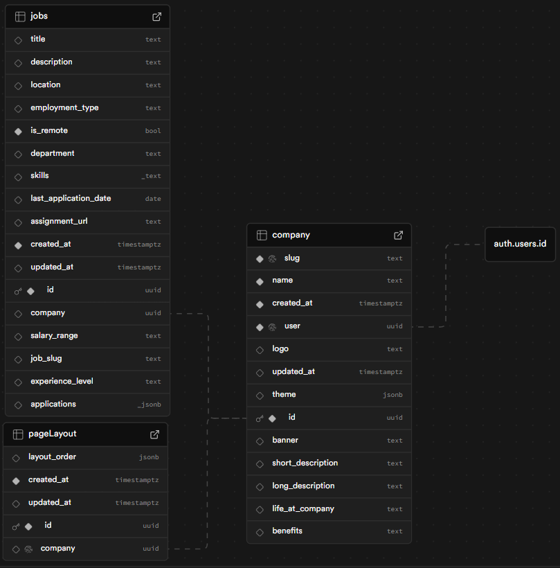

# FlowHire Careers Builder – Technical Specification

## 1. Overview

FlowHire Careers Builder is a Next.js + Supabase application that lets SaaS teams design, preview, and publish branded careers pages for their companies. It provides a full-screen editor with theming, layout control, and bulk job import, and generates a public-facing careers page per company.

**Goals**

- Enable a company to:
  - Configure branding (logo, colors, copy) once.
  - Control the layout of its careers page sections.
  - Import and manage job postings in bulk.
  - Preview changes before publishing and view a live careers page.

---

## 2. Assumptions

- Each authenticated user is associated with exactly one company for the editor experience.
- Company uniqueness is enforced via a slug (`company.slug`), used in routes like `/[slug]/edit`, `/[slug]/preview`, and `/[slug]/careers`.
- `Supabase` is used for:
  - Auth (email/password).
  - Database (Postgres with RLS).
- File assumptions for jobs import:
  - CSV/XLS/XLSX up to a few MB.
  - Uploaded and parsed client-side.
  - File storage in supabase bucket.
- UX assumptions:
  - Desktop-first experience, with the editor filling the viewport.
  - Public careers page should be usable on both desktop and mobile.

---

## 3. Architecture

### 3.1 High-Level

- **Frontend**
  - Next.js App Router (Next 16), with a mix of server and client components.
  - Shadcn + Tailwind CSS for styling.
- **Backend**
  - Supabase Postgres for `company`, `jobs`, `pageLayout`, and user mappings.
  - Supabase Auth for email/password authentication.
  - Next.js route handlers for:
    - Auth: login, logout, sign-up.
    - Jobs import.
    - Layout persistence.
- **Middleware**
  - A company check middleware that:
    - Verifies the user is authenticated.
    - Ensures they belong to the company referenced by `[slug]` for `/[slug]/edit`.
    - Redirects unauthorized users to login or 404.

### 3.2 Routing Structure

- **Auth**
  - `/auth/login` – login form.
  - `/auth/sign-up` – sign-up form, creates user + company.
  - `/auth/forgot-password` – triggers password reset email.

- **Editor**
  - `/[slug]/edit`
    - Layout: `app/[slug]/edit/layout.tsx`
      - Provides gradient background, and centers the main editor card.
    - Page: `app/[slug]/edit/page.tsx`
      - Validates session and retrieves the company by slug.
      - Renders `EditCompanyLayout` with the fetched company.

- **Preview**
  - `/[slug]/preview`
    - Shows the themed careers page as admins will see it, with FlowHire branding and controls.

- **Public Careers Page**
  - `/[slug]/careers`
    - Public, candidate-facing view of the company’s careers page.

---

## 4. Data Model / Schema

### Data Model Tables

#### `company`

| Column            | Type  | Description                    |
|-------------------|-------|--------------------------------|
| id                | uuid  | Company identifier             |
| slug              | text  | URL slug for the company       |
| name              | text  | Company name                   |
| logo              | text  | URL to logo image              |
| banner            | text  | URL to banner/hero image       |
| short_description | text  | Short marketing tagline        |
| long_description  | text  | Detailed company description   |
| life_at_company   | text  | “Life at company” section copy |
| benefits          | text  | Benefits/perks copy            |
| theme             | jsonb | Theming config (colors, etc.)  |

#### `jobs`

| Column              | Type            | Description                            |
|---------------------|-----------------|----------------------------------------|
| id                  | uuid            | Job identifier                         |
| company             | uuid            | Owning company                         |
| title               | text            | Job title                              |
| description         | text            | Full job description                   |
| location            | text            | Job location                           |
| salary_range        | text            | Human-readable salary info             |
| job_slug            | text            | Slug for job-specific URLs             |
| is_remote           | boolean         | Whether role is remote                 |
| department          | text            | Department or team                     |
| employment_type     | text            | Type of employment                     |
| experience_level    | text            | Seniority                              |
| jobtype             | text            | Normalized job type (from import)      |
| posted_days_ago     | integer         | Days since posting                     |
| skills              | text[] / jsonb  | List of skills/keywords                |
| last_application_date | date          | Last date to apply                     |

#### `pageLayout`

| Column       | Type           | Description                            |
|--------------|----------------|----------------------------------------|
| id           | uuid           | Layout row identifier                  |
| company      | uuid           | Company whose layout is stored         |
| layout_order | text[] / jsonb | Section order on careers/preview page  |

---

## 5. API Surface

### 5.1 Auth

- `POST /api/auth/login`
  - Body: `{ email, password }`
  - Validates credentials via Supabase; returns `{ companySlug }` or error.

- `POST /api/auth/sign-up`
  - Body: `{ email, password, companyName }`
  - Creates auth user and corresponding `company` entry; returns `{ companySlug }`.

- `POST /api/auth/logout`
  - Logs out current user session.

- Forgot password:
  - Uses `supabase.auth.resetPasswordForEmail` client-side; redirect target `/auth/forgot-password`.

### 5.2 Layout API

- `GET /api/company/[companyId]/layout`
  - Returns stored layout order or defaults.

- `POST /api/company/[companyId]/layout`
  - Body: `{ layout_order: LayoutSectionId[] }`
  - Upserts into `pageLayout`.

### 5.3 Jobs Import API

- `POST /api/company/[companyId]/jobs/import`
  - Body: `{ jobs: NormalizedJob[] }`
  - Validates required fields and inserts jobs in bulk.

---

## 6. Component Design

### 6.1 `EditCompanyLayout`

- Client component responsible for:
  - Tab state: `branding | jobs | layout`.
  - Fetching layout order on first load of Layout tab.
  - Rendering title/subtitle and full-height editor card.
- Layout:
  - Title section.
  - container for the card.
  - Card:
    - Left sidebar.
    - Right main content (tab content).

### 6.2 `Sidebar`

- Props: `activeTab`, `onChangeTab`, `slug`.
- Sections:
  - **Company settings**:
    - Branding
    - Jobs
    - Layout
  - Footer:
    - Preview: `/{slug}/preview`
    - Live Page: `/{slug}/careers`
    - Logout button

### 6.3 Tabs

- **BrandingTab**
  - Lets the user edit logo, banner, descriptions, and theme colors.
  - Saves changes to `company` table.

- **JobsTab**
  - Upload field for `.csv`, `.xlsx`, `.xls`.
  - Uses PapaParse for CSV and SheetJS for Excel.
  - Normalizes records and posts to jobs import API.

- **LayoutOrderEditor**
  - Displays current layout order with up/down arrows.
  - Save button persists layout to `pageLayout` API.

### 6.4 Preview and Careers Pages

- Common logic:
  - Fetch company by slug with theme applied.
  - Fetch jobs and layout order.
- Differences:
  - Preview: FlowHire branding header, admin context.
  - Careers: public-facing, minimal FlowHire branding.

---

## 7. Test Plan

### Manual Testing Checklist

| What to Test | How to Test | Should Happen |
|--------------|-------------|---------------|
| **Login/Signup/Reset** | 1. Sign up new account 2. Log out 3. Log back in 4. Test forgot password | 1. Lands on editor 2. Session gone 3. Back to editor 4. Email sent, reset works |
| **Company setup** | 1. New company 2. Add logo/banner URLs 3. Fill all text fields 4. Pick theme colors | Everything saves and shows in editor |
| **Theme check** | 1. Save theme changes 2. Check /slug/preview 3. Check /slug/careers | Colors match everywhere |
| **Job upload** | 1. Jobs tab 2. Upload sample.xlsx 3. Check it worked | Jobs show up on preview/careers |
| **Job details** | 1. Careers page 2. Click a job 3. Hit apply | Opens job page, apply works |
| **Mobile view** | 1. Open careers on phone 2. Scroll, tap around | Looks good, works smooth |
